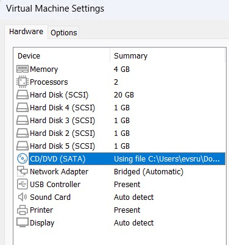

## Лабороторная работ 2. работа с mdadm.

### Задание.

- Добавить в виртуальную машину несколько дисков
- Собрать RAID-0/1/5/10 на выбор
- Сломать и починить RAID
- Создать GPT таблицу, пять разделов и смонтировать их в системе.

Добавим в ВМ 5ть дисков по 1GB


Проверим блочные устройства внутри ОС с помошью команды `lsblk`.
```
evs@ubuntu-srv01:~$ lsblk
NAME                      MAJ:MIN RM  SIZE RO TYPE MOUNTPOINTS
sda                         8:0    0   20G  0 disk
├─sda1                      8:1    0    1M  0 part
├─sda2                      8:2    0  1.8G  0 part /boot
└─sda3                      8:3    0 18.2G  0 part
  └─ubuntu--vg-ubuntu--lv 252:0    0   10G  0 lvm  /
sdb                         8:16   0    1G  0 disk
sdc                         8:32   0    1G  0 disk
sdd                         8:48   0    1G  0 disk
sde                         8:64   0    1G  0 disk
sdf                         8:80   0    1G  0 disk
sr0                        11:0    1 1024M  0 rom
```

Видим что у нас есть 5ть дисков по 1GB.

Занулим суперблоки командой `mdadm --zero-superblock --force /dev/sd{b,c,d,e,f}`

```
evs@ubuntu-srv01:~$ sudo mdadm --zero-superblock --force /dev/sd{b,c,d,e,f}
mdadm: Unrecognised md component device - /dev/sdb
mdadm: Unrecognised md component device - /dev/sdc
mdadm: Unrecognised md component device - /dev/sdd
mdadm: Unrecognised md component device - /dev/sde
mdadm: Unrecognised md component device - /dev/sdf
```

Вывод `mdadm: Unrecognised md component device` означает что дис не использовался для raid и можно продолжать дальше.

Будем собирать **RAID6** 
<details>
<summary>RAID 6</summary> 
массив дисков с поблочным чередованием с двумя контрольными суммами. Данные распределяются по дискам массива по очереди, в качестве информации для восстановления используется схема двойной четности. RAID 6 может выдержать отказ двух дисков одновременно, однако низкая производительность по операциям ввода-вывода (IOPS) ограничивает область применения.

Использование:

Сценарии применения RAID 6 аналогичны RAID 5 с уклоном в более надежное хранение информации. RAID 6 широко применяется в системах хранения данных, где не важна высокая транзакционная производительность — архивное хранение, видеонаблюдение стратегических объектов, использование в системах безопасности, а также для надежного хранения критически важных данных.
Преимущества:

значительное повышение скорости чтения по сравнению с дисками, не объединенными в RAID;
высокая степень надежности по сравнению с RAID 5, допустим выход из строя двух дисков.
Недостатки:

самая низкая скорость записи в IOPS;
эффективность использования дискового пространства ниже, чем у RAID 5.
Формула эффективности:

S * (N - 2), где N — количество дисков в массиве, S — объем наименьшего диска.
</details>

Создадим RAID командой `mdadm --create --verbose /dev/md0 -l 6 -n 5 /dev/sd{b,c,d,e,f}`

где:\
>-l - уровень рейд\
>-n - колличество дисков в RAID.\
>/dev/md0 - название нового устройства.

```
evs@ubuntu-srv01:~$ sudo mdadm --create --verbose /dev/md0 -l 6 -n 5 /dev/sd{b,c,d,e,f}
mdadm: layout defaults to left-symmetric
mdadm: layout defaults to left-symmetric
mdadm: chunk size defaults to 512K
mdadm: size set to 1046528K
mdadm: Defaulting to version 1.2 metadata
mdadm: array /dev/md0 started.
```

Проверяем что RAID собрался командой: `cat /proc/mdstat` и ` mdadm -D /dev/md0`

```
evs@ubuntu-srv01:~$ cat /proc/mdstat
Personalities : [raid0] [raid1] [raid4] [raid5] [raid6] [raid10] [linear]
md0 : active raid6 sdf[4] sde[3] sdd[2] sdc[1] sdb[0] # видим рейд активн, номер рейд и из каких дисков собран.
      3139584 blocks super 1.2 level 6, 512k chunk, algorithm 2 [5/5] [UUUUU]
```

```
evs@ubuntu-srv01:~$ sudo mdadm -D /dev/md0
/dev/md0:
           Version : 1.2
     Creation Time : Sun Apr 12 17:11:41 2026
        Raid Level : raid6
        Array Size : 3139584 (2.99 GiB 3.21 GB)
     Used Dev Size : 1046528 (1022.00 MiB 1071.64 MB)
      Raid Devices : 5
     Total Devices : 5
       Persistence : Superblock is persistent

       Update Time : Sun Apr 12 17:11:46 2026
             State : clean
    Active Devices : 5
   Working Devices : 5
    Failed Devices : 0
     Spare Devices : 0

            Layout : left-symmetric
        Chunk Size : 512K

Consistency Policy : resync

              Name : ubuntu-srv01:0  (local to host ubuntu-srv01)
              UUID : 1addf1e2:16d7312a:9efdc32f:4ebda252
            Events : 17

    Number   Major   Minor   RaidDevice State
       0       8       16        0      active sync   /dev/sdb
       1       8       32        1      active sync   /dev/sdc
       2       8       48        2      active sync   /dev/sdd
       3       8       64        3      active sync   /dev/sde
       4       8       80        4      active sync   /dev/sdf
```

Видим что рейд собрался и все диски активны.

#### Сломаем и починим RAID

Выключим ВМ и удалим один диск из настроек ВМ в VMWare.



После загрузки ВМ проверим состояние RAID.

```\evs@ubuntu-srv01:~$ cat /proc/mdstat
Personalities : [raid0] [raid1] [raid4] [raid5] [raid6] [raid10] [linear]
md127 : inactive sdb[0](S) sdc[1](S) sdd[2](S) sde[3](S)
      4186112 blocks super 1.2
```
Видим то-что RAID перешёл в неактивное состояние, так же он поменял свой номер.

Выключим ещё раз ВМ и обратно добавим диск. Проверим состояния.

```
evs@ubuntu-srv01:~$ cat /proc/mdstat
Personalities : [raid0] [raid1] [raid4] [raid5] [raid6] [raid10] [linear]
md127 : inactive sdb[0](S) sdc[1](S) sdd[2](S) sde[3](S)
      4186112 blocks super 1.2
```

RAID всё ещё не активен. Запустим его командой `mdadm --run /dev/md127`

Проверим:
```
evs@ubuntu-srv01:~$ cat /proc/mdstat
Personalities : [raid0] [raid1] [raid4] [raid5] [raid6] [raid10] [linear]
md127 : active (auto-read-only) raid6 sdb[0] sdc[1] sdd[2] sde[3]
      3139584 blocks super 1.2 level 6, 512k chunk, algorithm 2 [5/4] [UUUU_]
```
```
evs@ubuntu-srv01:~$ sudo mdadm -D /dev/md127
/dev/md127:
           Version : 1.2
     Creation Time : Sun Apr 12 17:11:41 2026
        Raid Level : raid6
        Array Size : 3139584 (2.99 GiB 3.21 GB)
     Used Dev Size : 1046528 (1022.00 MiB 1071.64 MB)
      Raid Devices : 5
     Total Devices : 4
       Persistence : Superblock is persistent

       Update Time : Sun Apr 12 17:11:46 2026
             State : clean, degraded
    Active Devices : 4
   Working Devices : 4
    Failed Devices : 0
     Spare Devices : 0

            Layout : left-symmetric
        Chunk Size : 512K

Consistency Policy : resync

              Name : ubuntu-srv01:0  (local to host ubuntu-srv01)
              UUID : 1addf1e2:16d7312a:9efdc32f:4ebda252
            Events : 17

    Number   Major   Minor   RaidDevice State
       0       8       16        0      active sync   /dev/sdb
       1       8       32        1      active sync   /dev/sdc
       2       8       48        2      active sync   /dev/sdd
       3       8       64        3      active sync   /dev/sde
       -       0        0        4      removed
```

RAID перещёл в активное состояние но одного диска не хватает.

Добавим диск командой `mdadm /dev/md127 --add /dev/sdf` и посмотрим процесс *rebuilding*

```
vs@ubuntu-srv01:~$ sudo mdadm /dev/md127 --add /dev/sdf
mdadm: added /dev/sdf
```
```
evs@ubuntu-srv01:~$ cat /proc/mdstat
Personalities : [raid0] [raid1] [raid4] [raid5] [raid6] [raid10] [linear]
md127 : active raid6 sdf[5] sdb[0] sdc[1] sdd[2] sde[3]
      3139584 blocks super 1.2 level 6, 512k chunk, algorithm 2 [5/4] [UUUU_]
      [=======>.............]  recovery = 38.2% (400640/1046528) finish=0.0min speed=200320K/sec

unused devices: <none>
```
RAID собрался и все диски на месте
```
evs@ubuntu-srv01:~$ cat /proc/mdstat
Personalities : [raid0] [raid1] [raid4] [raid5] [raid6] [raid10] [linear]
md127 : active raid6 sdf[5] sdb[0] sdc[1] sdd[2] sde[3]
      3139584 blocks super 1.2 level 6, 512k chunk, algorithm 2 [5/5] [UUUUU]
```

#### Создание GPT таблицы, разделов и монтирование их в системе

Создаем раздел GPT на RAID
```
parted -s /dev/md127 mklabel gpt
```
>-s -  script, не спрашивать вмешательства пользователя\
>mklabel - указваем тип таблицы gpt/msdos(mbr)

Создадим три раздела
```
evs@ubuntu-srv01:~$ sudo parted /dev/md127 mkpart primary ext4 0% 20%
Information: You may need to update /etc/fstab.

evs@ubuntu-srv01:~$ sudo parted /dev/md127 mkpart primary ext4 20% 80%
Information: You may need to update /etc/fstab.

evs@ubuntu-srv01:~$ sudo parted /dev/md127 mkpart primary ext4 80% 100%
Information: You may need to update /etc/fstab.
```
Проверим:
```
evs@ubuntu-srv01:~$ lsblk
NAME                      MAJ:MIN RM  SIZE RO TYPE  MOUNTPOINTS
sda                         8:0    0   20G  0 disk
├─sda1                      8:1    0    1M  0 part
├─sda2                      8:2    0  1.8G  0 part  /boot
└─sda3                      8:3    0 18.2G  0 part
  └─ubuntu--vg-ubuntu--lv 252:0    0   10G  0 lvm   /
sdb                         8:16   0    1G  0 disk
└─md127                     9:127  0    3G  0 raid6
  ├─md127p1               259:1    0  612M  0 part
  ├─md127p2               259:4    0  1.8G  0 part
  └─md127p3               259:5    0  612M  0 part
sdc                         8:32   0    1G  0 disk
└─md127                     9:127  0    3G  0 raid6
  ├─md127p1               259:1    0  612M  0 part
  ├─md127p2               259:4    0  1.8G  0 part
  └─md127p3               259:5    0  612M  0 part
sdd                         8:48   0    1G  0 disk
└─md127                     9:127  0    3G  0 raid6
  ├─md127p1               259:1    0  612M  0 part
  ├─md127p2               259:4    0  1.8G  0 part
  └─md127p3               259:5    0  612M  0 part
sde                         8:64   0    1G  0 disk
└─md127                     9:127  0    3G  0 raid6
  ├─md127p1               259:1    0  612M  0 part
  ├─md127p2               259:4    0  1.8G  0 part
  └─md127p3               259:5    0  612M  0 part
sdf                         8:80   0    1G  0 disk
└─md127                     9:127  0    3G  0 raid6
  ├─md127p1               259:1    0  612M  0 part
  ├─md127p2               259:4    0  1.8G  0 part
  └─md127p3               259:5    0  612M  0 part
sr0                        11:0    1 1024M  0 rom
```

Видим, что разделы создались.\
Теперь необходимо создать файловую систему на этих разделах.

Создадим ФС для первого раздела
```
vs@ubuntu-srv01:~$ sudo mkfs.ext4 /dev/md127p1
mke2fs 1.47.0 (5-Feb-2023)
Creating filesystem with 156672 4k blocks and 39200 inodes
Filesystem UUID: e8d3f907-7d68-43ef-816c-292c47345cf2
Superblock backups stored on blocks:
        32768, 98304

Allocating group tables: done
Writing inode tables: done
Creating journal (4096 blocks): done
Writing superblocks and filesystem accounting information: done
```

Теперь создадим ФС для двух оставшихся разделов скриптом из методички.
```
evs@ubuntu-srv01:for i in $(seq 2 3); do sudo mkfs.ext4 /dev/md127p$i; done
mke2fs 1.47.0 (5-Feb-2023)
Creating filesystem with 470784 4k blocks and 117840 inodes
Filesystem UUID: 3bb324f5-e10e-415b-8bc8-b7ea1720b786
Superblock backups stored on blocks:
        32768, 98304, 163840, 229376, 294912

Allocating group tables: done
Writing inode tables: done
Creating journal (8192 blocks): done
Writing superblocks and filesystem accounting information: done

mke2fs 1.47.0 (5-Feb-2023)
Creating filesystem with 156672 4k blocks and 39200 inodes
Filesystem UUID: bc754a36-c158-4c1f-96fa-b4880e63237c
Superblock backups stored on blocks:
        32768, 98304

Allocating group tables: done
Writing inode tables: done
Creating journal (4096 blocks): done
Writing superblocks and filesystem accounting information: done
```

Проверим создание ФС с помощью команды `lsblk -f`
```
evs@ubuntu-srv01:~$ lsblk -f
NAME                      FSTYPE            FSVER    LABEL          UUID                                   FSAVAIL FSUSE% MOUNTPOINTS
sda
├─sda1
├─sda2                    ext4              1.0                     e030673d-3fbe-4a19-b7a9-772d5c55a203      1.4G    12% /boot
└─sda3                    LVM2_member       LVM2 001                b1OJK7-gfId-o6d9-VlfJ-m3lJ-s38Y-2qX0hr
  └─ubuntu--vg-ubuntu--lv ext4              1.0                     7cfbad6b-7de6-413c-928b-77c462e6ffac        6G    33% /
sdb                       linux_raid_member 1.2      ubuntu-srv01:0 1addf1e2-16d7-312a-9efd-c32f4ebda252
└─md127
  ├─md127p1               ext4              1.0                     e8d3f907-7d68-43ef-816c-292c47345cf2
  ├─md127p2               ext4              1.0                     3bb324f5-e10e-415b-8bc8-b7ea1720b786
  └─md127p3               ext4              1.0                     bc754a36-c158-4c1f-96fa-b4880e63237c
sdc                       linux_raid_member 1.2      ubuntu-srv01:0 1addf1e2-16d7-312a-9efd-c32f4ebda252
└─md127
  ├─md127p1               ext4              1.0                     e8d3f907-7d68-43ef-816c-292c47345cf2
  ├─md127p2               ext4              1.0                     3bb324f5-e10e-415b-8bc8-b7ea1720b786
  └─md127p3               ext4              1.0                     bc754a36-c158-4c1f-96fa-b4880e63237c
sdd                       linux_raid_member 1.2      ubuntu-srv01:0 1addf1e2-16d7-312a-9efd-c32f4ebda252
└─md127
  ├─md127p1               ext4              1.0                     e8d3f907-7d68-43ef-816c-292c47345cf2
  ├─md127p2               ext4              1.0                     3bb324f5-e10e-415b-8bc8-b7ea1720b786
  └─md127p3               ext4              1.0                     bc754a36-c158-4c1f-96fa-b4880e63237c
sde                       linux_raid_member 1.2      ubuntu-srv01:0 1addf1e2-16d7-312a-9efd-c32f4ebda252
└─md127
  ├─md127p1               ext4              1.0                     e8d3f907-7d68-43ef-816c-292c47345cf2
  ├─md127p2               ext4              1.0                     3bb324f5-e10e-415b-8bc8-b7ea1720b786
  └─md127p3               ext4              1.0                     bc754a36-c158-4c1f-96fa-b4880e63237c
sdf                       linux_raid_member 1.2      ubuntu-srv01:0 1addf1e2-16d7-312a-9efd-c32f4ebda252
└─md127
  ├─md127p1               ext4              1.0                     e8d3f907-7d68-43ef-816c-292c47345cf2
  ├─md127p2               ext4              1.0                     3bb324f5-e10e-415b-8bc8-b7ea1720b786
  └─md127p3               ext4              1.0                     bc754a36-c158-4c1f-96fa-b4880e63237c
sr0
```

Видим что ФС ext4 на разделах создана. Теперь смонтируем их.

Создадим директории для точек монтирования:
```
evs@ubuntu-srv01:~$ sudo mkdir -p /raid/part{1,2,3}
```
Смонтируем разделы
```
evs@ubuntu-srv01:~$ for i in $(seq 1 3);do sudo mount /dev/md127p$i /raid/part$i; done
```
Проверим смонтируемые разделы командлой `df -h`
```
evs@ubuntu-srv01:~$ df -h
Filesystem                         Size  Used Avail Use% Mounted on
tmpfs                              387M  1.6M  385M   1% /run
/dev/mapper/ubuntu--vg-ubuntu--lv  9.8G  3.3G  6.1G  35% /
tmpfs                              1.9G     0  1.9G   0% /dev/shm
tmpfs                              5.0M     0  5.0M   0% /run/lock
/dev/sda2                          1.8G  207M  1.5G  13% /boot
tmpfs                              387M   12K  387M   1% /run/user/1000
/dev/md127p1                       586M   24K  543M   1% /raid/part1
/dev/md127p2                       1.8G   24K  1.7G   1% /raid/part2
/dev/md127p3                       586M   24K  543M   1% /raid/part3
```

Видим что разделы смонтированы.

